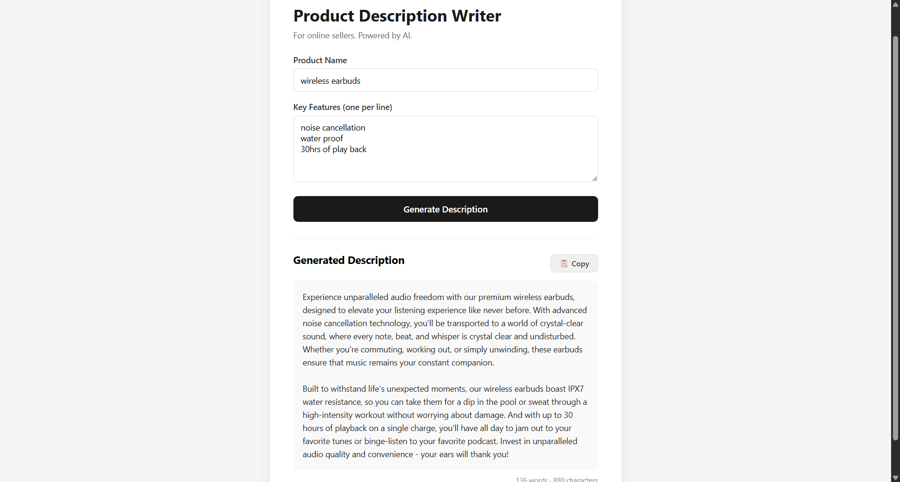

# Product Description Writer

An AI-powered web app that generates compelling product descriptions for online sellers (Amazon, Shopify, Etsy, Flipkart). Built with a local LLM for zero API costs and offline functionality.



## ✨ Features

- 🤖 **Real AI generation** — Powered by Llama 3.2 running locally via Ollama
- ⚡ **Streaming responses** — Words appear in real-time as the AI generates them (ChatGPT-style)
- 🎨 **Clean, modern UI** — Polished card-based design with intuitive UX
- 📋 **One-click copy** — Copy descriptions to clipboard with visual feedback
- 📊 **Live word/character counter** — Track length for marketplace limits
- 🔄 **Dynamic loading states** — Cycling progress messages keep users informed
- 🏠 **100% local** — No API keys, no costs, no data leaves your machine

## 🛠️ Built With

**Frontend**
- HTML5, CSS3, Vanilla JavaScript
- Fetch API with chunked streaming for real-time responses

**Backend**
- Python 3.11
- Flask (web server + REST API)
- Streaming HTTP responses via Flask's `stream_with_context`

**AI/ML**
- Ollama (local LLM runtime)
- Llama 3.2 (3B parameters)

## 📋 Prerequisites

- Python 3.11 or higher
- [Ollama](https://ollama.com) installed
- 8 GB RAM minimum (16 GB recommended)

## 🚀 Getting Started

**1. Clone the repository**
```bash
git clone https://github.com/deepakcr7suii/product-writer.git
cd product-writer
```

**2. Install Python dependencies**
```bash
pip install -r requirements.txt
```

**3. Install and start Ollama**

Download from [ollama.com](https://ollama.com), then pull the model:
```bash
ollama pull llama3.2
```

**4. Run the Flask server**
```bash
python app.py
```

**5. Open in browser**

Navigate to `http://localhost:5000` and start generating!

## 🏗️ How It Works

```
┌─────────────────┐    HTTP    ┌──────────────┐    HTTP    ┌─────────────┐
│                 │ ─────────> │              │ ─────────> │             │
│   Web Browser   │            │ Flask Server │            │   Ollama    │
│   (Frontend)    │ <───────── │  (Backend)   │ <───────── │  (Llama 3.2)│
│                 │  Streaming │              │  Streaming │             │
└─────────────────┘            └──────────────┘            └─────────────┘
```

1. User fills in product name + features in the browser
2. Frontend sends data to Flask's `/generate` endpoint
3. Flask crafts a prompt and forwards to Ollama's streaming API
4. Ollama generates description word-by-word
5. Each word flows back through Flask to the browser in real-time
6. User sees the description "typing" live on screen

## 📁 Project Structure

```
product-writer/
├── app.py                  # Flask backend + Ollama integration
├── requirements.txt        # Python dependencies
├── templates/
│   └── index.html          # Main UI template
├── static/
│   ├── script.js           # Frontend logic + streaming handler
│   └── style.css           # Styling
├── screenshots/
│   └── demo.png            # Demo screenshot
├── LICENSE
└── README.md
```

## 🎯 Use Cases

- E-commerce sellers writing product listings
- Dropshippers scaling content creation
- Content creators generating product reviews
- Marketing teams drafting copy quickly

## 🔮 Roadmap

- [ ] Multiple tone options (Professional, Casual, SEO, Social Media)
- [ ] Save description history
- [ ] Bulk generation from CSV
- [ ] Multi-language support
- [ ] Cloud deployment option

## 👤 Author

**Deepak**
- GitHub: [@deepakcr7suii](https://github.com/deepakcr7suii)
- Mechatronics Engineering Student | Building AI-powered tools

## 📝 License

This project is open source and available under the [MIT License](LICENSE).

---

⭐ If you found this useful, give it a star on GitHub!